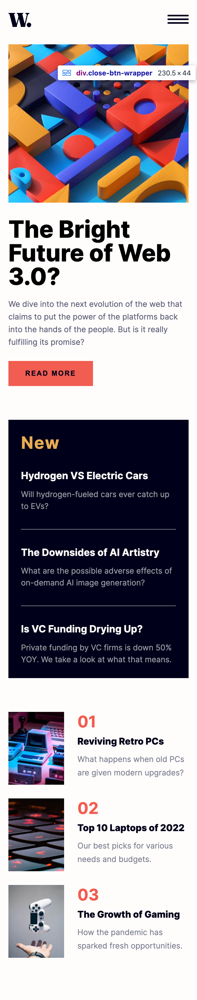

# Frontend Mentor - News homepage solution

This is a solution to the [News homepage challenge on Frontend Mentor](https://www.frontendmentor.io/challenges/news-homepage-H6SWTa1MFl). Frontend Mentor challenges help you improve your coding skills by building realistic projects.

## Table of contents

- [Overview](#overview)
  - [The challenge](#the-challenge)
  - [Screenshot](#screenshot)
  - [Links](#links)
- [My process](#my-process)
  - [Built with](#built-with)
  - [What I learned](#what-i-learned)
  - [Continued development](#continued-development)

## Overview

### The challenge

Users should be able to:

- View the optimal layout for the interface depending on their device's screen size
- See hover and focus states for all interactive elements on the page

### Screenshot




### Links

- Solution URL: [GitHub](https://github.com/Ayako-Yokoe/news-homepage-main)
- Live Site URL: [Vercel](https://news-homepage-bay.vercel.app/)

## My process

### Built with

- Semantic HTML5 markup
- CSS custom properties
- Flexbox
- CSS Grid
- Mobile-first workflow

### What I learned

I learned how to implement a hamburger menu with a sliding animation.

```html
<button aria-label="Open menu" class="open-btn" id="open-btn">
  
</button>
<div class="hamburger-menu" id="hamburger-menu">
  <div class="close-btn-wrapper">
    <button aria-label="Close menu" class="close-btn" id="close-btn">
      
    </button>
  </div>
</div>
```

```css
.hamburger-menu {
  width: 70%;
  height: 100vh;
  z-index: 1;
  position: absolute;
  top: 0;
  right: -300px;
  background-color: var(--color-off-white);
  padding: 1.5rem 1rem;
  transition: all 0.3s ease;
}

.hamburger-menu.visible {
  right: 0;
}
```

```js
openBtn.addEventListener("click", () => {
  hamburgerMenu.classList.add("visible")
})

closeBtn.addEventListener("click", () => {
  hamburgerMenu.classList.remove("visible")
})
```

### Continued development

I'll continue learning more about smooth animations and vanilla JavaScript.

# news-homepage-main
